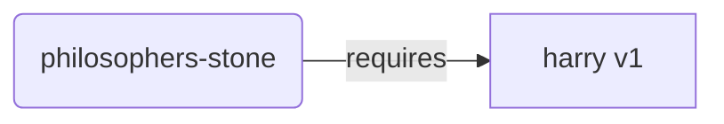
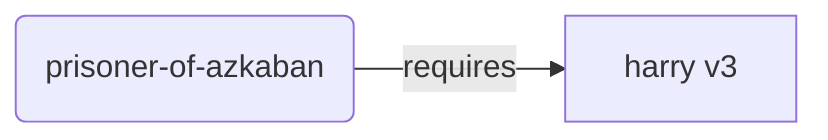
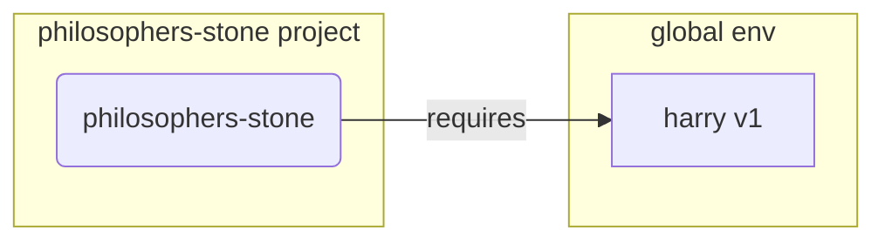
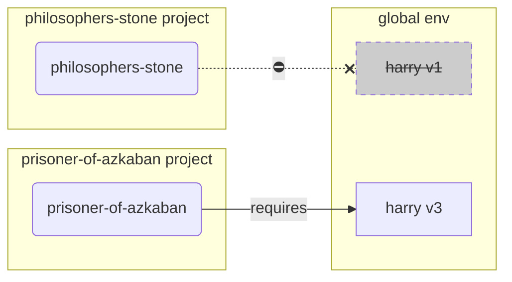
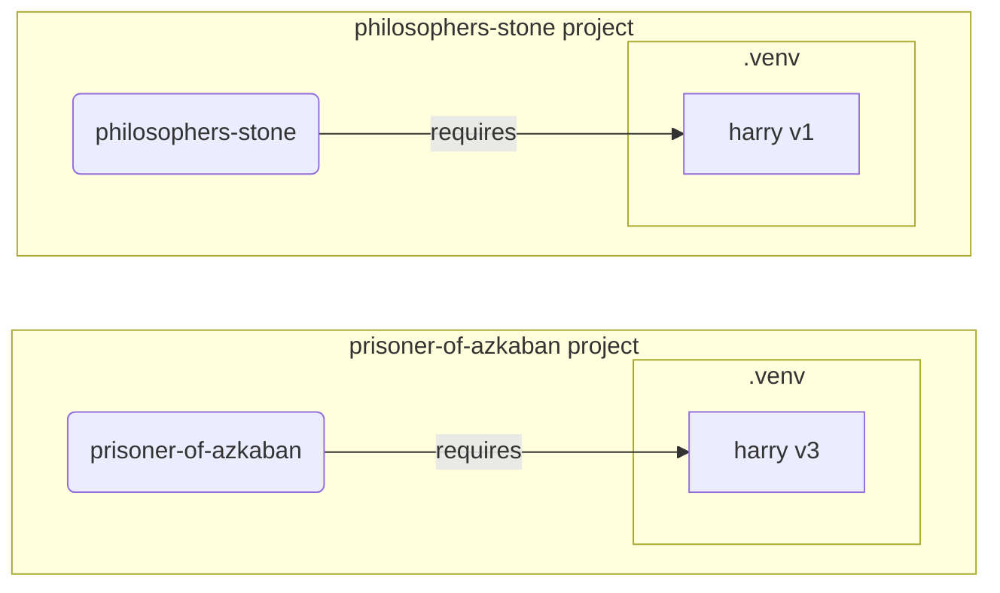

# 仮想環境

Python プロジェクトで作業するときは、プロジェクトごとにインストールするパッケージを分離するため、**仮想環境**（または同様の仕組み）を使うべきであることがほとんどです。

/// info

仮想環境とは何か、作り方や使い方をすでに知っているなら、この節は読み飛ばしても構いません。🤓

///

/// tip

**仮想環境**は**環境変数**とは別物です。

**環境変数**は、プログラムが利用できるシステム上の変数です。

**仮想環境**は、いくつかのファイルが入った 1 つのディレクトリです。

///

/// info

このページでは、**仮想環境**の使い方とその仕組みを説明します。

もし、Python のインストールも含めて**すべてを管理してくれるツール**を使う準備ができているなら、<a href="https://github.com/astral-sh/uv" class="external-link" target="_blank">uv</a> を試してください。

///

## プロジェクトを作成する

まず、プロジェクト用のディレクトリを作成します。

私が普段やっているのは、ホームディレクトリ配下に `code` という名前のディレクトリを作ることです。

そして、その中にプロジェクトごとのディレクトリを 1 つずつ作成します。

<div class="termy">

```console
// ホームディレクトリへ移動
$ cd
// コード用のディレクトリを作成
$ mkdir code
// そのディレクトリへ移動
$ cd code
// このプロジェクト用のディレクトリを作成
$ mkdir awesome-project
// プロジェクトディレクトリへ移動
$ cd awesome-project
```

</div>

## 仮想環境を作成する

Python プロジェクトに**初めて**取りかかるときは、**<abbr title="他の選択肢もありますが、ここでは分かりやすい基本方針を示しています">プロジェクトの中に</abbr>** 仮想環境を作成してください。

/// tip

これは**プロジェクトごとに 1 回だけ**行えばよく、作業するたびに毎回やる必要はありません。

///

//// tab | `venv`

仮想環境を作るには、Python に付属している `venv` モジュールを使えます。

<div class="termy">

```console
$ python -m venv .venv
```

</div>

/// details | このコマンドの意味

* `python`: `python` というプログラムを使う
* `-m`: モジュールをスクリプトとして実行する。次にその対象を指定する
* `venv`: 通常 Python に付属している `venv` モジュールを使う
* `.venv`: `.venv` という新しいディレクトリに仮想環境を作成する

///

////

//// tab | `uv`

<a href="https://github.com/astral-sh/uv" class="external-link" target="_blank">`uv`</a> がインストール済みなら、これを使って仮想環境を作ることもできます。

<div class="termy">

```console
$ uv venv
```

</div>

/// tip

デフォルトでは、`uv` は `.venv` というディレクトリに仮想環境を作成します。

ただし、追加引数でディレクトリ名を渡せば変更できます。

///

////

このコマンドは `.venv` というディレクトリに新しい仮想環境を作成します。

/// details | `.venv` か別の名前か

別のディレクトリ名で仮想環境を作ることもできますが、`.venv` とするのが慣例です。

///

## 仮想環境を有効化する

新しく作った仮想環境を有効化すると、以後に実行する Python コマンドやインストールするパッケージは、その仮想環境を使うようになります。

/// tip

これは、プロジェクトの作業を始めるたびに**新しいターミナルセッションごとに毎回**実行してください。

///

//// tab | Linux, macOS

<div class="termy">

```console
$ source .venv/bin/activate
```

</div>

////

//// tab | Windows PowerShell

<div class="termy">

```console
$ .venv\Scripts\Activate.ps1
```

</div>

////

//// tab | Windows Bash

Windows で Bash を使っている場合（たとえば <a href="https://gitforwindows.org/" class="external-link" target="_blank">Git Bash</a>）は、次のようにします。

<div class="termy">

```console
$ source .venv/Scripts/activate
```

</div>

////

/// tip

その環境に**新しいパッケージ**をインストールしたあとは、もう一度環境を**有効化**してください。

そうすることで、そのパッケージがインストールした**ターミナル（<abbr title="command line interface">CLI</abbr>）プログラム**を使うときに、グローバルに入っている別のものではなく、仮想環境内のものを確実に使えます。グローバル側のものは、必要なバージョンと違う可能性があります。

///

## 仮想環境が有効か確認する

仮想環境が有効になっているか、つまり先ほどのコマンドが正しく動いたかを確認します。

/// tip

これは**任意**ですが、意図した仮想環境を使えていて、すべてが期待どおりに動いていることを**確認**する良い方法です。

///

//// tab | Linux, macOS, Windows Bash

<div class="termy">

```console
$ which python

/home/user/code/awesome-project/.venv/bin/python
```

</div>

`.venv/bin/python` のように、プロジェクト（この例では `awesome-project`）配下の `python` バイナリが表示されていれば成功です。🎉

////

//// tab | Windows PowerShell

<div class="termy">

```console
$ Get-Command python

C:\Users\user\code\awesome-project\.venv\Scripts\python
```

</div>

`.venv\Scripts\python` のように、プロジェクト（この例では `awesome-project`）配下の `python` バイナリが表示されていれば成功です。🎉

////

## `pip` をアップグレードする

/// tip

<a href="https://github.com/astral-sh/uv" class="external-link" target="_blank">`uv`</a> を使うなら、`pip` ではなく `uv` でインストールするので、`pip` をアップグレードする必要はありません。😎

///

パッケージのインストールに `pip` を使う場合（Python に標準で入っています）、最新バージョンへ**アップグレード**しておくべきです。

パッケージのインストール時に起こる妙なエラーの多くは、先に `pip` を更新するだけで解決します。

/// tip

通常は、仮想環境を作成した直後に**1 回だけ**実行します。

///

仮想環境が有効になっていることを確認してから、次を実行します。

<div class="termy">

```console
$ python -m pip install --upgrade pip

---> 100%
```

</div>

## `.gitignore` を追加する

**Git** を使っているなら（使うべきです）、`.venv` の中身を Git の管理対象から外すために `.gitignore` ファイルを追加します。

/// tip

仮想環境の作成に <a href="https://github.com/astral-sh/uv" class="external-link" target="_blank">`uv`</a> を使った場合は、この設定を `uv` がすでにやってくれるので、この手順は不要です。😎

///

/// tip

これも仮想環境を作成した直後に**1 回だけ**行います。

///

<div class="termy">

```console
$ echo "*" > .venv/.gitignore
```

</div>

/// details | このコマンドの意味

* `echo "*"`: `*` という文字列をターミナルに「表示」する（ただし次の部分で少し動きが変わる）
* `>`: 左側のコマンドがターミナルへ出力した内容を表示せず、代わりに右側のファイルへ書き込む
* `.gitignore`: そのテキストを書き込むファイル名

Git における `*` は「すべて」を意味します。したがって、`.venv` ディレクトリ内のすべてが無視されます。

このコマンドは、次の内容を持つ `.gitignore` ファイルを作成します。

```gitignore
*
```

///

## パッケージをインストールする

仮想環境を有効化したら、その中にパッケージをインストールできます。

/// tip

これは、プロジェクトに必要なパッケージをインストールまたは更新するときに**その都度**行います。

バージョンを上げたり新しいパッケージを追加したりするなら、**再度**この作業を行います。

///

### 直接インストールする

急いでいて、プロジェクトのパッケージ要件を宣言するファイルをまだ使いたくない場合は、直接インストールしても構いません。

/// tip

プログラムが必要とするパッケージ名とバージョンは、`requirements.txt` や `pyproject.toml` のようなファイルに書いておくのが（とても）良い考えです。

///

//// tab | `pip`

<div class="termy">

```console
$ pip install typer

---> 100%
```

</div>

////

//// tab | `uv`

<a href="https://github.com/astral-sh/uv" class="external-link" target="_blank">`uv`</a> がある場合は:

<div class="termy">

```console
$ uv pip install typer
---> 100%
```

</div>

////

### `requirements.txt` からインストールする

`requirements.txt` があるなら、それに書かれたパッケージ群を使ってインストールできます。

//// tab | `pip`

<div class="termy">

```console
$ pip install -r requirements.txt
---> 100%
```

</div>

////

//// tab | `uv`

<a href="https://github.com/astral-sh/uv" class="external-link" target="_blank">`uv`</a> がある場合は:

<div class="termy">

```console
$ uv pip install -r requirements.txt
---> 100%
```

</div>

////

/// details | `requirements.txt`

いくつかのパッケージを書いた `requirements.txt` は、たとえば次のようになります。

```requirements.txt
typer==0.13.0
rich==13.7.1
```

///

## プログラムを実行する

仮想環境を有効化したあとでプログラムを実行すると、そこにインストールしたパッケージを使う、その仮想環境内の Python が利用されます。

<div class="termy">

```console
$ python main.py

Hello World
```

</div>

## エディタを設定する

おそらく何らかのエディタを使うはずなので、作成したものと同じ仮想環境を使うよう設定してください。たいていは自動検出されます。そうすることで、補完やインラインエラー表示が使えるようになります。

たとえば:

* <a href="https://code.visualstudio.com/docs/python/environments#_select-and-activate-an-environment" class="external-link" target="_blank">VS Code</a>
* <a href="https://www.jetbrains.com/help/pycharm/creating-virtual-environment.html" class="external-link" target="_blank">PyCharm</a>

/// tip

これも通常は、仮想環境を作成するときに**1 回だけ**設定すれば十分です。

///

## 仮想環境を無効化する

プロジェクトでの作業が終わったら、仮想環境を**無効化**できます。

<div class="termy">

```console
$ deactivate
```

</div>

こうしておくと、その後 `python` を実行したときに、その仮想環境にある Python とインストール済みパッケージを使おうとしなくなります。

## 作業を始める準備完了

これで、プロジェクト作業を始める準備が整いました。

/// tip

ここまでの内容が内部的にどういうことなのか理解したいですか？

そのまま読み進めてください。👇🤓

///

## なぜ仮想環境が必要なのか

Typer を使うには、まず <a href="https://www.python.org/" class="external-link" target="_blank">Python</a> をインストールする必要があります。

そのうえで、Typer や使いたい**パッケージ**を**インストール**する必要があります。

通常、パッケージのインストールには Python に付属する `pip` コマンド（または同等の代替ツール）を使います。

ただし、単に `pip` をそのまま使うと、パッケージは**グローバルな Python 環境**（Python のグローバルインストール）に入ってしまいます。

### 問題点

では、パッケージをグローバルな Python 環境にインストールすることの何が問題なのでしょうか。

やがて、**異なるパッケージ**に依存する複数のプログラムを書くことになるはずです。そして、その中には**同じパッケージの別バージョン**に依存するプロジェクトも出てきます。😱

たとえば、`philosophers-stone` というプロジェクトを作ったとします。このプログラムは **`harry` のバージョン `1`** に依存しています。つまり `harry` をインストールする必要があります。



その後しばらくして、`prisoner-of-azkaban` という別のプロジェクトを作ったとします。このプロジェクトも `harry` に依存していますが、必要なのは **`harry` バージョン `3`** です。



ここで問題になるのは、ローカルの**仮想環境**ではなくグローバル環境にパッケージを入れていると、どちらの `harry` を入れるか選ばなければならないことです。

`philosophers-stone` を動かしたいなら、まずは `harry` バージョン `1` をインストールする必要があります。たとえば次のようにします。

<div class="termy">

```console
$ pip install "harry==1"
```

</div>

すると、グローバルな Python 環境には `harry` バージョン `1` が入ります。



しかし次に `prisoner-of-azkaban` を動かしたくなったら、`harry` バージョン `1` をアンインストールして、バージョン `3` をインストールしなければなりません（あるいはバージョン `3` を入れた時点で、自動的にバージョン `1` が置き換わります）。

<div class="termy">

```console
$ pip install "harry==3"
```

</div>

すると今度は、グローバルな Python 環境には `harry` バージョン `3` が入ります。

その状態で再び `philosophers-stone` を動かそうとすると、必要なのは `harry` バージョン `1` なので、**動かない**可能性があります。



/// tip

Python パッケージでは、新しいバージョンで**破壊的変更を避ける**よう最大限努力するのが一般的です。それでも、安全のためには、テストを実行して問題なく動くことを確認できるタイミングで、意図的に新しいバージョンを入れるほうがよいです。

///

さて、これがあなたの**すべてのプロジェクト**が依存する**多数のパッケージ**で同時に起こると想像してください。管理は非常に難しくなり、どこかが動かないときに、どのパッケージの**互換性のないバージョン**が原因なのか分からなくなりがちです。

また、使っている OS（Linux、Windows、macOS など）によっては、もともと Python がインストール済みの場合があります。その場合、OS が必要とする特定バージョンのパッケージも一緒に入っている可能性があります。そこへグローバルな Python 環境に追加でパッケージを入れると、OS に付属していたプログラムを**壊してしまう**ことさえあります。

## パッケージはどこにインストールされるのか

Python をインストールすると、コンピュータ上にいくつかのディレクトリとファイルが作成されます。

その中には、インストールしたパッケージ群を保持する役割のディレクトリも含まれています。

次のように実行すると:

<div class="termy">

```console
// 今は実行しないでください。説明用の例です 🤓
$ pip install typer
---> 100%
```

</div>

Typer のコードを含む圧縮ファイルが、通常は <a href="https://pypi.org/project/typer/" class="external-link" target="_blank">PyPI</a> からダウンロードされます。

さらに、Typer が依存している他のパッケージのファイルも**ダウンロード**されます。

そして、それらのファイルはすべて**展開**されて、あなたのコンピュータ上のどこかのディレクトリへ配置されます。

デフォルトでは、ダウンロードして展開されたそれらのファイルは、Python のインストール先に付属するディレクトリ、つまり**グローバル環境**に入ります。

## 仮想環境とは何か

パッケージがすべてグローバル環境に入ってしまう問題への解決策は、作業する**各プロジェクトごとに仮想環境を使う**ことです。

仮想環境は、プロジェクト用のパッケージをインストールできる、グローバル環境によく似た**ディレクトリ**です。

こうすることで、各プロジェクトはそれぞれ独自の仮想環境（`.venv` ディレクトリ）と、その中の独自パッケージ群を持てます。



## 仮想環境を有効化するとはどういうことか

たとえば、仮想環境を次のように有効化するとします。

//// tab | Linux, macOS

<div class="termy">

```console
$ source .venv/bin/activate
```

</div>

////

//// tab | Windows PowerShell

<div class="termy">

```console
$ .venv\Scripts\Activate.ps1
```

</div>

////

//// tab | Windows Bash

Windows で Bash を使っている場合（たとえば <a href="https://gitforwindows.org/" class="external-link" target="_blank">Git Bash</a>）は、次のようにします。

<div class="termy">

```console
$ source .venv/Scripts/activate
```

</div>

////

このコマンドは、後続のコマンドから利用できるいくつかの [環境変数](environment-variables.ja.md){.internal-link target=_blank} を作成または変更します。

その 1 つが `PATH` 変数です。

/// tip

`PATH` 環境変数については [環境変数](environment-variables.ja.md#path-environment-variable){.internal-link target=_blank} の節で詳しく説明しています。

///

仮想環境を有効化すると、そのパス `.venv/bin`（Linux と macOS）または `.venv\Scripts`（Windows）が `PATH` 環境変数に追加されます。

たとえば、仮想環境を有効化する前の `PATH` 変数が次のようだったとします。

//// tab | Linux, macOS

```plaintext
/usr/bin:/bin:/usr/sbin:/sbin
```

これは、システムが次のディレクトリでプログラムを探すことを意味します。

* `/usr/bin`
* `/bin`
* `/usr/sbin`
* `/sbin`

////

//// tab | Windows

```plaintext
C:\Windows\System32
```

これは、システムが次のディレクトリでプログラムを探すことを意味します。

* `C:\Windows\System32`

////

仮想環境を有効化した後は、`PATH` 変数はたとえば次のようになります。

//// tab | Linux, macOS

```plaintext
/home/user/code/awesome-project/.venv/bin:/usr/bin:/bin:/usr/sbin:/sbin
```

つまり、システムはまず次のディレクトリから先にプログラムを探すようになります。

```plaintext
/home/user/code/awesome-project/.venv/bin
```

そのあとで、他のディレクトリを見ます。

そのため、ターミナルで `python` と入力すると、システムは次の場所にある Python プログラムを見つけて:

```plaintext
/home/user/code/awesome-project/.venv/bin/python
```

それを使います。

////

//// tab | Windows

```plaintext
C:\Users\user\code\awesome-project\.venv\Scripts;C:\Windows\System32
```

つまり、システムはまず次のディレクトリから先にプログラムを探すようになります。

```plaintext
C:\Users\user\code\awesome-project\.venv\Scripts
```

そのあとで、他のディレクトリを見ます。

そのため、ターミナルで `python` と入力すると、システムは次の場所にある Python プログラムを見つけて:

```plaintext
C:\Users\user\code\awesome-project\.venv\Scripts\python
```

それを使います。

////

重要なのは、仮想環境のパスが `PATH` 変数の**先頭**に置かれるという点です。システムは、他の Python よりも**先に**それを見つけます。つまり `python` を実行したとき、グローバル環境などにある別の `python` ではなく、**仮想環境の Python** が使われます。

仮想環境の有効化は他にもいくつかの変更を行いますが、これはその中でも特に重要なものの 1 つです。

## 仮想環境を確認する

たとえば、仮想環境が有効かどうかを次のように確認したとします。

//// tab | Linux, macOS, Windows Bash

<div class="termy">

```console
$ which python

/home/user/code/awesome-project/.venv/bin/python
```

</div>

////

//// tab | Windows PowerShell

<div class="termy">

```console
$ Get-Command python

C:\Users\user\code\awesome-project\.venv\Scripts\python
```

</div>

////

これは、実際に使われる `python` プログラムが**仮想環境の中にあるもの**だという意味です。

Linux と macOS では `which`、Windows PowerShell では `Get-Command` を使います。

このコマンドは、`PATH` 環境変数を**順番に 1 つずつ**たどりながら、`python` という名前のプログラムを探します。見つかった時点で、そのプログラムの**パスを表示**します。

最も重要なのは、`python` と呼び出したときに実行されるのが、その表示された "`python`" そのものであることです。

つまり、今使っている仮想環境が正しいかどうかを確認できます。

/// tip

1 つの仮想環境を有効化して、その Python を使ったまま**別のプロジェクトへ移動してしまう**のはよくあることです。

すると、2 つ目のプロジェクトは**動かなくなる**かもしれません。理由は、そのプロジェクト用ではない、**別プロジェクトの仮想環境**にある Python を使ってしまっているからです。

いまどの `python` が使われているのか確認できるのは便利です。🤓

///

## なぜ仮想環境を無効化するのか

たとえば、`philosophers-stone` というプロジェクトで作業していて、その仮想環境を**有効化**し、パッケージをインストールして作業していたとします。

その後、**別のプロジェクト** `prisoner-of-azkaban` で作業したくなったとします。

そのプロジェクトへ移動します。

<div class="termy">

```console
$ cd ~/code/prisoner-of-azkaban
```

</div>

もし `philosophers-stone` の仮想環境を無効化しないままだと、ターミナルで `python` を実行したときに、`philosophers-stone` の Python を使おうとしてしまいます。

<div class="termy">

```console
$ cd ~/code/prisoner-of-azkaban

$ python main.py

// sirius を import できない。インストールされていない 😱
Traceback (most recent call last):
    File "main.py", line 1, in <module>
        import sirius
```

</div>

しかし、仮想環境を無効化してから `prisoner-of-azkaban` 用の新しい仮想環境を有効化すれば、`python` を実行したときに `prisoner-of-azkaban` の仮想環境にある Python が使われます。

<div class="termy">

```console
$ cd ~/code/prisoner-of-azkaban

// 古いディレクトリにいなくても無効化できる。別プロジェクトへ移動したあとでも大丈夫 😎
$ deactivate

// prisoner-of-azkaban/.venv の仮想環境を有効化 🚀
$ source .venv/bin/activate

// これで python を実行すると、この仮想環境に入っている sirius パッケージが見つかる ✨
$ python main.py

I solemnly swear 🐺
```

</div>

## 代替手段

ここまでは、仮想環境の使い始めに必要な最小限と、その**内部で何が起きているか**を理解するためのシンプルなガイドです。

仮想環境、パッケージ依存関係（requirements）、プロジェクト管理には、ほかにも多くの**代替手段**があります。

ひととおり分かってきて、プロジェクト全体、パッケージ依存、仮想環境などを**まとめて管理**するツールを使いたくなったら、<a href="https://github.com/astral-sh/uv" class="external-link" target="_blank">uv</a> を試すことをおすすめします。

`uv` には多くの機能があります。たとえば次のことができます。

* 異なるバージョンを含めて **Python をインストール**してくれる
* プロジェクトの**仮想環境**を管理できる
* **パッケージ**をインストールできる
* プロジェクトのパッケージ**依存関係とバージョン**を管理できる
* 依存先も含めて、インストールされるパッケージとバージョンの**正確な組み合わせ**を固定し、開発中の自分の環境と本番環境を同じ状態に保てる。これは **locking** と呼ばれる
* そのほかにも多くのことができる

## まとめ

ここまで読んで理解できたなら、あなたはすでに、多くの開発者よりも**仮想環境についてよく知っている**はずです。🤓

この知識は、将来なにか複雑そうな問題をデバッグするときに、おそらく役に立ちます。なぜなら、**内部でどう動いているか**を理解しているからです。😎
